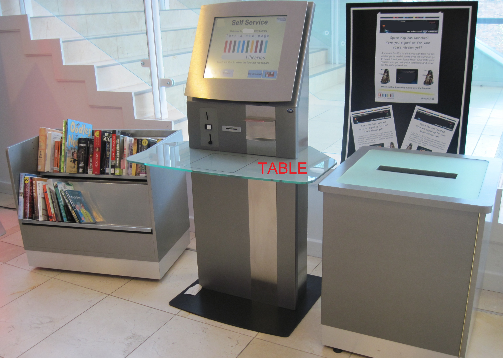
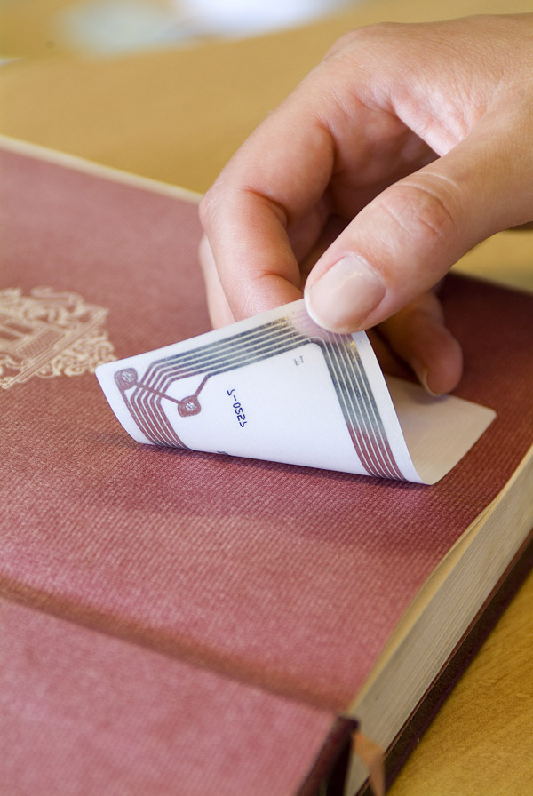

### Get any book(s) from any library that uses a self-service machine, with zero-chance of being caught... 

#### works on reserved books too.

## Introduction – a inconvenient truth about automation

Many libraries around the world, especially in the UK are now replacing qualified and experienced librarians with self-service machines. This hack would not be possible if we still employed human librarians.

The library (3 storey high) this hack was successfully carried out on had hired a private security company to regularly patrol it (4-man team with radios) and was covered with at least 30 CCTV cameras (no blind spots) and had an RFID anti-theft gate at the entrance and exits (the library was also busy).

# Instructions

 1. Make sure you are registered with the library. You need this, so you
    can reserve any book you want on the library catalogue and avoid
    detection.
    
 2. Choose the book you want, either reserve it or find it in the
    library.
 3. With the book you want, find another two or more books with **long
    titles** (these books will be the **decoys**).
 4. Borrow the books normally at self-service machine, make sure to keep
    the receipt.
 5. Leave the library.
 6. At home, peel off the RFID sticker (normally found at the back or
    front of the book) .
 7. You now get to keep the book(s) you want.
 8. You need the RFID stickers you peeled off, keep them in your
    personal wallet or at the bottom of a rucksack/messenger bag.
 9. **WAIT**  2 – 3 days.
 10. You now need to go back to the library WITH the decoy books only
     and the RFID stickers in your personal wallet or in a
     rucksack/messenger bag.
 11. **IMPORTANT**: Go to the Self-service machine and place the decoy books
     on the table/return area as you would normally when returning a
     book.
 12. **IMPORTANT**: you also place your wallet or your bag on the table too
     (your bag/wallet will have the RFID stickers hidden inside).
 13. You will now see the books you have at home show on the screen (as
     well as the decoys)
 14. Follow any instructions on the machine, make sure to print a
     receipt.
 15. You now need to get rid of the RFID sticker you have in your
     bag/wallet. Go to a toilet and flush them or you can put them in a
     bin inside the library.
 16. You can now leave the library without the alarms going off ::smiley
     face::

# FAQ

***Why does this work?***

The self-service machines used in all libraries around the world can only recognise a book by the RFID (Radio Frequency Identify Device) sticker. When you return the sticker instead of a book, the machines assumes you have returned a real book. It will update the library database, there is absolutely no evidence that you stole the book(s).

The RFID stickers need to be placed in a bag to or wallet, to avoid detection. The RFID stickers can be detected by the machine at a distance of at least 15 – 30 cm and through thick materials.

You keep the receipts as extra proof, even though you don’t necessarily need to.

***Why do you need the decoy books?***

To avoid any suspicion. If any staff/security member walks by you, it looks like your legitimately retuning books. The books with long titles also make it hard for anyone glancing at the screen to know what books you are really returning.

***Why do you need to wait 2-3 days at step 9?***

To avoid detection, if you back on the same day it will look suspicious.

***Why do you need to throw away the RFID stickers at step 15 ?***

Your library will have the Anti-theft gates at the entrances and exits. These gates only pickup the RFID stickers (by emitting a radio frequency at the stickers and checking its response frequency) and check the library database. So, you need to get rid of stickers in the library before leaving.
